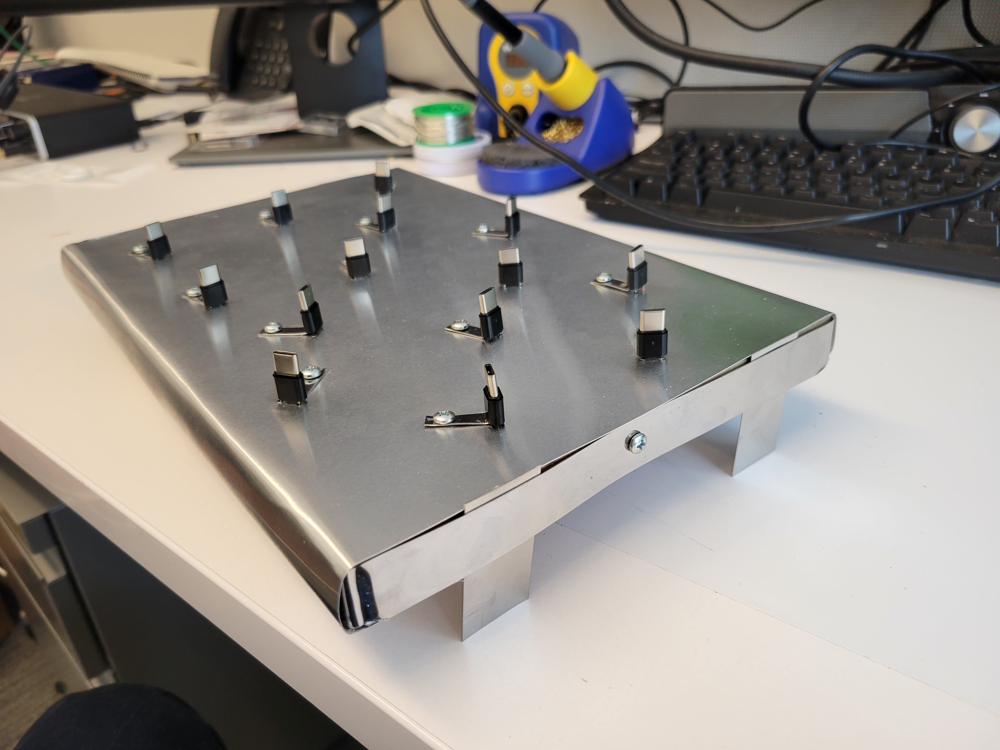

# Build a generative art using ESP32 TTGO T-Display

Components needed: ESP32 TTGO T-Display, type-C wire, laptop

1. Firstly, download the correct version of Arduino that fit your computer system
2. Open the sketch_love.ino with the Arduino
3. Connect the ESP32 TTGO T-Display to your computer using a type C USB wire
4. On the interface of Arduino, go to Tools → Port, and select the right port that is suitable for your computer, then go to Tools → Board → esp32 and select TTGO T1. In this way, the ESP32 should be connected to the computer
5. Hit the upload button in Arduino, and uplaod the code into esp32. Start seeing the code are being compiled and uploaded to esp32. Then, the screen is able to display the visual message
6. In the class, the professor built a metal platform for us to plug our ESP32s in. The platform can power 14 ESp32s at the same time.

*This is the front of the completely built platform.*

*This is the back of the platform.*

7. After we plugged in our esp32s into the platform, connected the platform to a controllable power supplier and turned on the power, our esp32s started to dispaly the visual messages:

8. This sketch_love program make the esp32 to display visuals as follows: it shows some pink, large digits of “5201314” at first, and then shows the words “Please!”, “Love!”, “Yourself!” in black subsequently, and then it shows a long sentence of black text in pink background saying “It’s more importanat than loving anyone else in the world!”, and then it repeats from the start as only showing the digits.

